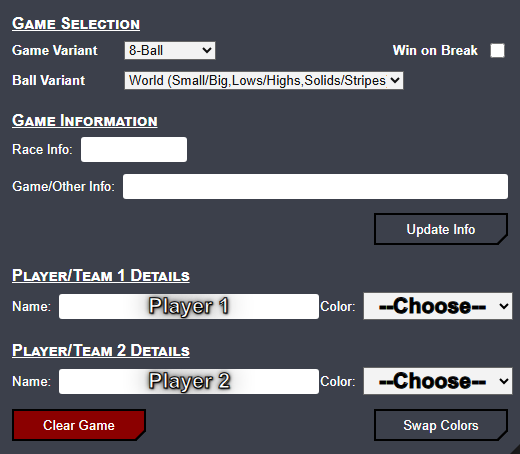
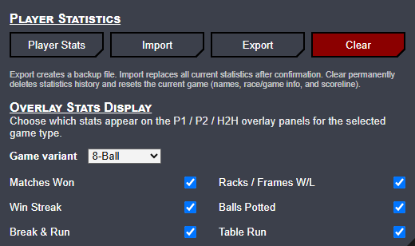
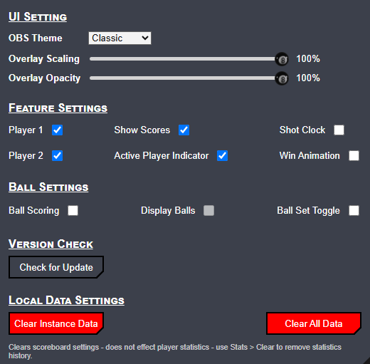
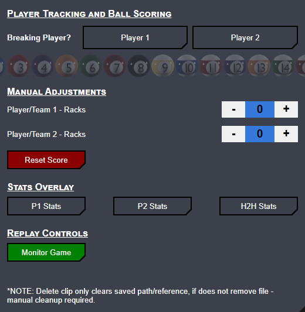
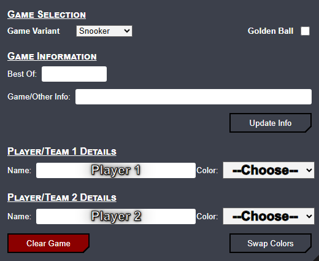

# CueSport Scoreboard — Release Notes

**5.0.2 → 7.2.0** · August 2026

CueSport Scoreboard has grown from a focused scoreboard dock into a full match-control and statistics platform for pool, snooker, and custom formats. This document summarizes everything that changed between **v5.0.2** and **v7.2.0**.

---

## At a glance

| Version | Highlights |
|---------|------------|
| **5.0.2** | Baseline — dual-score ball tracking (Bank / One Pocket), stream sharing, replay controls |
| **6.0.0** | Player statistics (IndexedDB), overlay stats panels, name autocomplete |
| **6.0.1** | Stats overlay performance and autocomplete polish |
| **6.1.0** | Ball Scoring visibility, stats UI improvements |
| **7.1.9** | **Snooker** scoring, snooker ball art, dual-score display fixes |
| **7.2.0** | Game Setup redesign, Breaking Player flow, scoring **Undo**, Win on Break / Early Game Ball, smoke tests |

---

## Screenshots

### Setup — Game Selection & options

### Stats tab

### Settings — Ball Scoring

### Controls — Breaking Player & ball grid

### Snooker setup

---

## Major features since 5.0.2

### Player statistics (6.0.0+)

- Local **IndexedDB** roster (`cuesport_stats`) — survives instance clears; shared across all tables on the same origin.
- Live recording of racks/frames, balls potted, breaks, B&R / Table Run (8/9/10).
- **Stats modal**: Board (leaderboard), Player detail, H2H comparison.
- **Import / Export** JSON backup; **Clear** wipes history and resets the current game.
- **In-progress match** editing and **Discard Match** from Player / H2H views.
- **Overlay stats** (P1 / P2 / H2H) — draggable panels on the browser source; per-game-type visibility toggles on the Stats tab.
- Name **autocomplete** and **double-click** full roster browse on Setup name fields.

### Snooker (7.1.9+)

- Full **Snooker** game variant with frames + points, red/colour sequence, fouls, **Free Ball**, **Golden Ball**.
- Dedicated snooker ball images on the control-panel grid (not shown on overlay).
- Snooker-specific undo stack (pots and fouls per frame).
- Live overlay fields: Current Break, Possible Break, Difference, Points Remaining.

### Ball Scoring & control panel (6.1.0 → 7.2.0)

- **Player Tracking and Ball Scoring** and **Manual Adjustments** (renamed from Manual Controls).
- Consolidated ball tracker panel with **Undo** icon.
- **8 / 9 / 10-Ball**: pot game ball → auto rack; object-ball pots tracked for **Balls Potted** stats.
- **Bank / One Pocket**: tracker pots award balls; first to 8 wins the rack.
- **Straight Pool**: each pot +1 primary **Balls**; 14.1 re-rack when one ball remains.
- **Win on Break** (8-Ball) and **Early Game Ball / Win on Break** (9-Ball & 10-Ball, separate settings).

### Breaking Player (7.2.0)

- **Breaking Player?** / **Active Player** for **all game types** when Ball Scoring is on.
- Grid locked until breaker is chosen; visit switching via greyed opponent button.
- Straight Pool re-prompts after each **14.1 re-rack**.
- **Undo** can take back a mistaken breaker pick.
- State persists across refresh; mid-rack refresh restores Active Player and faded balls.

### Scoring Undo (7.2.0)

- Pool undo: ball fades, rack wins/losses, pocket pots, straight-pool pots, breaker picks.
- Snooker undo: frame pots and fouls.
- **Reset Score**, **End Match**, **Call Match Early**, and **game-type changes** clear undo history.

### Game type switching (7.2.0)

- Switching variant auto-finalizes the open match (End Match / Call Match Early / Reset Score).
- Clears scoreline, undo history, and breaker state for the new game type.

### UI & quality of life

- **Setup** split into **Game Selection** + **Game Information**.
- Dock **zoom** and **last tab** saved per `instance`.
- **`tests/smoke_test.html`** — automated regression suite (100+ checks).

---

## Breaking changes & migration

| Area | Note |
|------|------|
| **Stats** | First launch after upgrade creates `cuesport_stats` automatically. Use **Export** before major upgrades. |
| **Ball Scoring** | Now opt-in in Settings; not auto-enabled per game type. |
| **Game Details** | Renamed to **Game Selection**; race/Best Of moved to **Game Information**. |
| **Clear Game** | Abandons in-progress stats session; use **Stats → Clear** for full DB wipe. |
| **Multiple instances** | Use matching `?instance=` on control panel and browser source. |

---

Full changelog workflow: see [`docs/release-notes/README.md`](../README.md).
