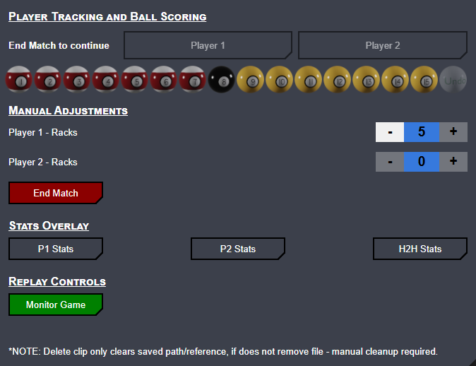

# CueSport Scoreboard — Release Notes

**7.2.1 → 7.2.2** · August 2026

Minor release: **Ultimate Pool Balls** art option, and snooker no longer offers or plays a win animation (no snooker-specific clip yet).

---

## Screenshots

### Controls — Ultimate Pool Balls

---

## What's new

### Ultimate Pool Balls

- New **Ball Variant** option: **Ultimate Pool Balls** (`ultimate-#ball-small.png`).
- Available wherever Ball Variant is shown (e.g. **8-Ball**, **Custom**).
- Updates the control-panel scoring grid, overlay ball display, and Chosen Ball indicators when Ball Set Toggle is on.
- Group labels match World style (Smalls/Lows/Solids & Bigs/Highs/Stripes).

### Snooker — win animation

- Win animation does **not** run for Snooker game type or Snooker ball variant (avoids playing a pool clip).
- The **Win Animation** setting is hidden while Snooker is active; your previous preference is restored when you leave Snooker.

---

## Upgrade notes

- No database migration required. Reload the control panel and browser source after updating (cache-busting query strings bumped to **7.2.2**).
- Add the new `common/images/ultimate-*-ball-small.png` assets with the update.

---

See [`docs/release-notes/7.2.1/RELEASE_NOTES.md`](../7.2.1/RELEASE_NOTES.md) for 7.2.1 fixes, and [`7.2.0/RELEASE_NOTES.md`](../7.2.0/RELEASE_NOTES.md) for the full feature overview.
