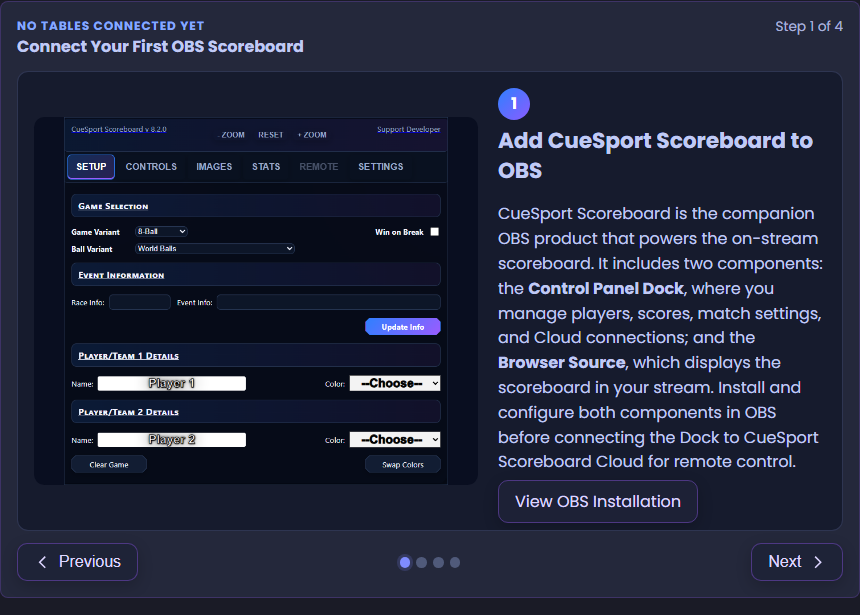
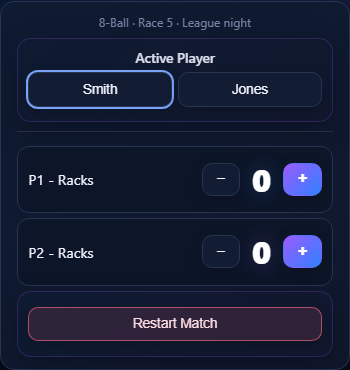

# CueSport Scoreboard — Release Notes

**7.2.2 → 8.2.0** · September 2026

Major release: introducing **CueSport Scoreboard Cloud** — optional hosted or self-hosted remote scoring, multi-table management, match history, player statistics, guest controls, and live-stream discovery for the OBS CueSport Scoreboard.

The scoreboard remains free, GPL-licensed software and continues to work locally without Cloud. Cloud adds connected services around the existing OBS dock and browser source.

---

## Headline: CueSport Scoreboard Cloud

CueSport Scoreboard Cloud connects the OBS dock, web dashboard, phones, and guest scorers through a live relay. The OBS dock remains the scoring authority: remote commands use the same match logic as controls clicked directly in OBS, then updated state is sent back to every connected screen.

### Choose hosted or self-hosted

- **Hosted service** — sign in with Google at [cuesport.macleod.systems](https://cuesport.macleod.systems), choose a plan, and let the managed service handle the relay, account, and storage.
- **Self-hosted** — run the included backend yourself with Node.js or Docker. Self-hosting is free and unrestricted, uses one server-owner account, and has no Stripe requirement.
- **Delegate without extra accounts** — create a uniquely named OBS Dock Key for each table or operator and assign Administrator, Trusted Operator, or Operator permissions. Temporary guest links provide focused mobile scoring access.
- **One Dock Key = one cloud table** — keys can be individually shared, renamed, or revoked, and each key may connect one OBS dock at a time.

---

## Remote scoring from any device

- Full mobile control for players, breaker, scores, balls, fouls, undo, race, event information, and match actions.
- Responsive table list for moving between multiple connected OBS scoreboards.
- Guest links and QR codes for scorers who should not receive account or replay access.
- One active device per guest link, with immediate individual or account-wide revocation.
- An OBS Dock Owner guest role can also access Stream and Share controls.
- Connection safeguards stop remote controls from drifting when the dock or relay is offline.
- Restart Match, End Match, and Call Match Early use explicit confirmation.

---

## A new Cloud dashboard

The web dashboard now provides:

- Live cards for every connected table, including current players, game, race, score, and connection state.
- Named OBS Dock Key creation, sharing, role editing, individual revocation, and **Revoke All**.
- Unique active Dock Key names, with revoked names becoming available again.
- Account, subscription, session, and sign-out controls in dedicated navigation.
- A visual first-table setup guide covering the OBS dock, Cloud connection, key creation, and connection process.
- Stable loading screens and cleaner navigation between the dashboard and mobile controller.

Hosted service operators also receive a separate Platform Admin workspace for customer support, account inspection, complimentary access, session/key actions, and safe account deletion. Platform Admin and simulated subscriptions are not shown on self-hosted deployments.

---

## Cloud match history and player statistics

- Account leaderboard with sortable player performance and **Date Added**.
- Recent completed and in-progress matches.
- Player detail filtered by opponent and game.
- Rename players across their history, edit match details, or delete incorrect records.
- Players use UUID identities, allowing multiple different players to have the same display name.
- Duplicate names are disambiguated with additional identity and activity details.
- Match history survives temporary table cleanup and OBS reconnection.
- **Kill** removes an unfinished cloud match and tells the connected dock to clear the board and return to Setup.
- Highest Break for Snooker and Longest Run for Straight Pool are tracked independently.
- Correct Break & Run and Table Run capture for 8-Ball, 9-Ball, and 10-Ball.

---

## Stream and replay improvements

- Promote an active OBS stream to the public **Live Streams** page with live match information.
- Stream promotion only remains listed while OBS reports that streaming is active.
- Mobile Stream controls can start/stop OBS streaming and manage supported overlay statistics.
- Replay controls and permissions are available to authorized remote operators.
- The disconnected OBS Remote tab now explains hosted and self-hosted Cloud options and links directly to connection settings.

---

## Hosted plans and billing

- Stripe-hosted Checkout and Customer Portal integration.
- Streamer, Tournament Organizer, and League Director plans use prices supplied directly by Stripe.
- Streamer can include a card-required free trial; higher tiers bill immediately.
- Trial eligibility is protected against repeated signup with the same identity.
- Automatic Stripe Tax, billing-address collection, and business tax-ID collection.
- Platform admins can grant time-limited **Complimentary access** without a card or charge.
- Inactive accounts receive clear plan-selection guidance while existing subscribers can manage payment and cancellation through Stripe.

Billing applies only to the optional managed service. Self-hosted deployments remain free and unrestricted.

---

## OBS dock and interface updates

- New optional **Modern Cloud** visual theme.
- Refreshed purple-first controls across the OBS dock, dashboard, and mobile interface.
- Improved responsive headers, navigation, score sizing, spacing, and desktop width.
- Remote connection status and setup guidance are clearer.
- Manual Active Player changes now create their own Undo entry without reversing scores or pots.
- Snooker foul, free-ball, current-break, possible-break, difference, and points-remaining behavior received extensive corrections and test coverage.
- Ultimate Pool Balls remain available alongside the existing ball variants.

---

## Security and account lifecycle

- Signed self-host tokens with account-wide session invalidation.
- Role-scoped Dock Key permissions and one-live-dock-per-key enforcement.
- Account deletion can disconnect active clients, revoke credentials, remove the authentication identity, and optionally block future signup.
- Hosted deletion warns before cancelling active Stripe subscriptions.
- Deleted-account, blocklist, and trial-history identity records use keyed fingerprints rather than retaining plaintext email addresses.

---

## Upgrade notes

- Reload the OBS control panel and browser source after updating so the new **8.2.0** assets are used.
- Cloud is optional. Existing local scoreboard operation does not require a backend or account.
- To self-host, copy `backend/.env.example` to `backend/.env`, set `DEV_AUTH_SECRET`, `DEV_AUTH_ACCOUNT_EMAIL`, and `PUBLIC_URL`, then run `npm start` or Docker Compose.
- Existing self-hosted servers should restart or rebuild their backend container after updating; changing static files alone does not reload backend modules.
- SQLite schema upgrades run on backend startup. Back up `backend/data/` before upgrading.
- Supabase deployments should apply migrations through `007_account_player_created_at.sql`.
- Managed deployments require live Stripe Price IDs, webhook signing secret, Customer Portal configuration, and the documented webhook events.

See the root [README](../../../README.md) and [backend guide](../../../backend/README.md) for complete hosted and self-hosted setup.

---

## Prior releases

See [`7.2.2/RELEASE_NOTES.md`](../7.2.2/RELEASE_NOTES.md) and earlier folders for previous changelogs.
